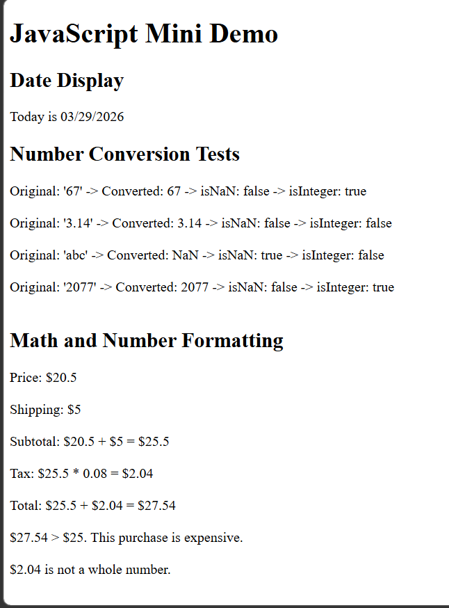

## GitHub pages
[https://m1chaelguerrer0.github.io/9HW-484/](https://m1chaelguerrer0.github.io/9HW-484/)

## Screenshot

## Reflection

I overall found everything was easy, especially working with variables and displaying results on the webpage. I did not have much trouble with anything but I did learn that the `Date` object starts at 0 for the months and needs to be adjusted when formatting the date. I learned that the `Number` object is useful for converting values and checking if they are valid numbers like Number.`isNaN()` and `isInteger()`. I also learned about `toLocaleString()` which was very easy to use. I learned that displaying results is quite easy and simple.